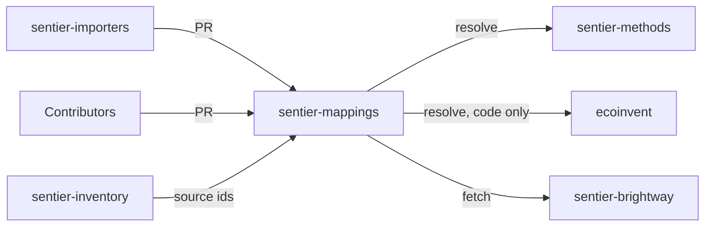

# sentier-mappings



Cross-source bridges for the Sentier platform, stored as
[randonneur](https://github.com/brightway-lca/randonneur) JSON packages.

## What it is

- A Data Layer repo: loadable artifacts only, no fetch, parse, or calculate code.
- Bridges link inventory source ids to method flow keys and to ecoinvent codes.
- Written in by `sentier-importers` and by contributors, always via PR.
- Read by `sentier-brightway`, which fetches a pinned ref of `data/` at build time.
- The why lives in [sentier.dev](https://github.com/sentier-dev/sentier.dev).

## Install

Nothing to install. The validator needs `jsonschema[format]` and `pytest`; `uv run` fetches them.

## Use

Validate every pair against the schemas (what CI runs):

```bash
uv run --with-requirements scripts/requirements.txt python scripts/validate.py
```

Run the validator's own tests:

```bash
uv run --with-requirements scripts/requirements.txt pytest -q tests
```

## Layout

```
schema/     JSON Schemas for packages and metadata.json, plus conventions
data/       one folder per source__target pair
scripts/    validate.py, the CI validator, and its requirements.txt
tests/      pytest suite for validate.py
```

## Data

| Pair | Kind | Packages | Entries |
|---|---|---|---|
| `agribalyse-3.2__ecoinvent-3.9.1` | foreground to background | stub, `target_proprietary: true` | 0 |
| `agribalyse-3.2__ef-3.1` | elementary flow to CF | `biosphere.json` | 1,095 |
| `bafu-2026-v1__ef-3.1` | elementary flow to CF | `biosphere-1-curated` to `biosphere-4-nomenclature` | 2,566 |
| `eaternity-bafu-ext__ef-3.1` | elementary flow to CF | `biosphere.json` | 19,275 |
| `ecoinvent-biosphere3__eaternity-bafu-ext` | flow to flow | `biosphere.json` | 1,371 |

- Folder name: `data/<source>__<target>/`, lower-kebab, version-suffixed ids, no rank prefix.
- One package per kind: `<kind>.json`. Several of one kind: `<kind>-<n>-<slug>.json`, `n` from 1.
- `n` is build order and precedence within the pair only. An earlier file wins on a shared source key.
- The validator guarantees the packages of one pair never disagree on a source key.
- `metadata.json` lists the packages in order plus any sidecars (non-normative review or coverage files).

| Kind | Bridge spans | File | Target encoding |
|---|---|---|---|
| Foreground to background | inventory source to ecoinvent | `technosphere.json` | `{database, code}`, opaque code only |
| Process to process | inventory source to inventory source | `technosphere.json` | full open identifiers |
| Elementary flow to CF | inventory flows to method flow keys | `biosphere.json` | full open identifiers |

No proprietary ecoinvent data:

- A bridge that targets ecoinvent sets `target_proprietary: true` in its `metadata.json`.
- Its targets carry only `database` and `code`.
- Never `name`, `reference product`, `location`, amounts, or flows.
- A licensed ecoinvent holder resolves the code locally at link time.
- `scripts/validate.py` enforces this on every PR.

## Schema

- `metadata.schema.json`: pair identity and the ordered `packages` list, `schema_version` 0.2.0.
- `randonneur-package.schema.json`: the randonneur package profile.
- Verbs, precedence, and conventions: [schema/README.md](./schema/README.md).

## Contributing

- Open a PR against `main`. CI runs the validator and its tests on every PR.
- Put new data in a pair folder whose `metadata.json` lists every package and sidecar.

## License

MIT — open by default, client-loadable.
